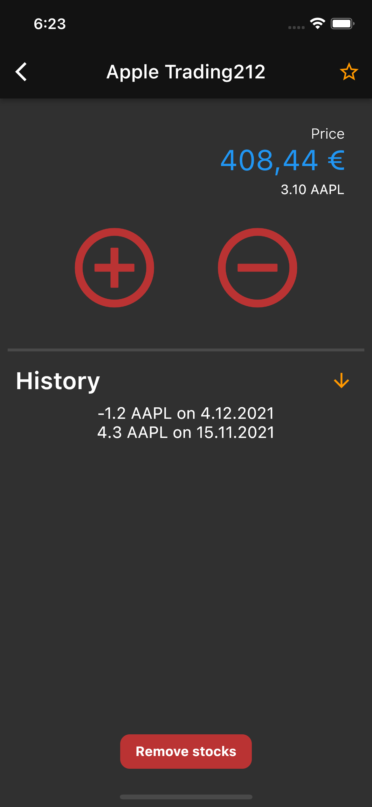
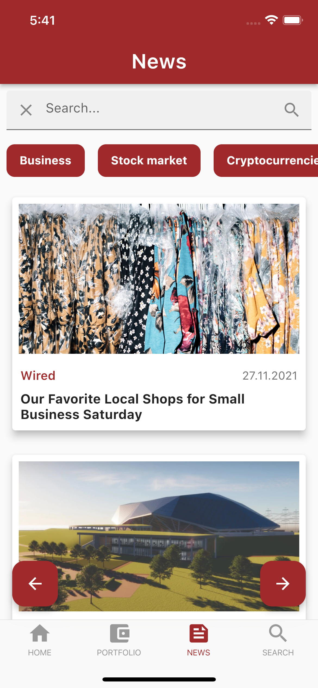
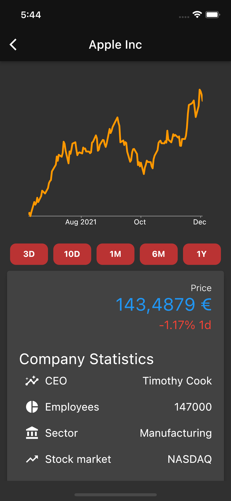
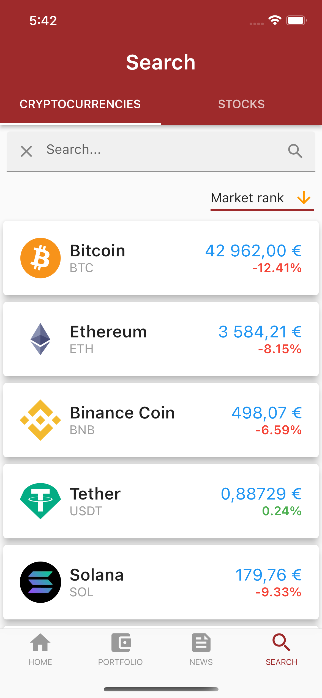

# Application Finfo

## Description

Finfo is a comprehensive mobile app for tracking stocks and cryptocurrencies. It supports Android 6.0+ and iOS 9.0+ and is localized in English and Slovak languages, making it easily accessible to a wide range of users. With its simple and user-friendly interface, you can easily monitor the performance of your investments and stay up-to-date with market trends. The app also allows you to browse the latest news in finance and technology, keeping you informed on the latest developments in the industry. The app is developed using Flutter and features native UI components, ensuring a smooth and seamless experience. 

## Screenshots

     
     
     
     

## Getting Started

This application was created with Flutter version 2.5.2 and Dart version 2.14.3 and is compatible with newest Flutter 2.8.0 and Dart 2.15.0.
The latest version of Flutter, which includes Dart, can be downloaded here: [Flutter Installation](https://docs.flutter.dev/get-started/install). Follow the official instructions and set up Flutter SDK, Android Studio and optionally Xcode for your specific platform. 

### Setting up the project:
1. Navigate to the project folder in terminal or open the project folder in Visual Studio Code
2. Run command "flutter doctor", to check that Flutter is installed properly
3. Run command "flutter pub get" to download required packages, which were used during the development
